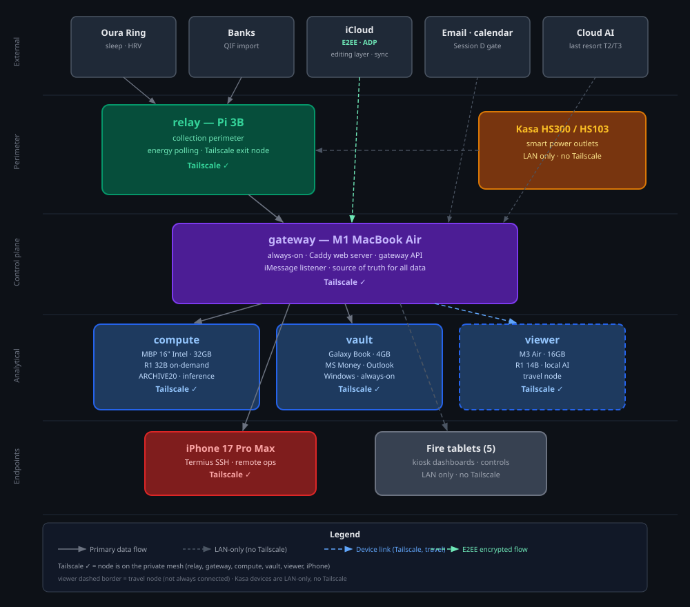

# AiMe

*A life assistant that runs on your own hardware, running AI only you can access, using your data that never leaves your home.*

Built by a power systems engineer who realized the thinking patterns from his day job — how to design systems that are reliable, recoverable, and always tell the truth about their own state — applied just as well to building a private, reliable, and safe life management system using hardware he already has.

> **A note on the name:**
>
> Read it three ways:
>
> 1. *AI Me* — a model of yourself.
> 2. *Aim me* — give me direction.
> 3. *AI me* — let AI process my life, make it legible to me.
>
> The deeper idea: your data doesn't need to be organized for this to work. AiMe builds a clean layer on top of whatever mess already exists. You don't have to clean up first.

---

## Table of Contents

| | | |
|---|---|---|
| [The Core Idea](#the-core-idea) | [Why I'm Building This](#why-im-building-this) | [Core Use Cases](#core-use-cases) |
| [What I've Built With Claude's Help](#what-ive-built-with-claudes-help) | [How It Works](#how-it-works) | [Philosophy](#philosophy) |
| [Current State](#current-state) | [Documents](#documents) | [For Builders](#for-builders) |

---

## The Core Idea

**Getting Things Done** (GTD) is a productivity system built on one insight: your brain is a bad reminder system. Every task you haven't done, every commitment you've made, every thing you need to remember — all of it is taking up mental space in the background, even when you can't do anything about it.

The solution GTD proposes is simple: capture everything in a system outside your head, organized so the right things surface at the right time. When you trust the system, your brain stops spinning.

AiMe is that system, built on AI and your own hardware.

Most reminder and productivity apps fail because they add steps instead of removing them. You still have to remember to check the app. You still have to maintain it. The reminders still pile up. AiMe is designed differently — the system does the monitoring, does the maintenance, and comes to you when something actually needs your attention.

The goal: **the background hum of "what am I forgetting" quiets. Permanently.**

---

## Why I'm Building This

### The working memory problem

Some people's brains are excellent at holding context (short-term memory). They can switch between tasks, pick up where they left off, and remember to do things at the right moment. Their mental filing cabinet works.

For the rest of us, like myself, we drop context constantly. Interrupt a thought and it's gone. Switch between tasks and the first one evaporates. Have 47 browser tabs open because closing them means losing the thing. Remember something important at 2am. Forget it completely by morning.

This isn't a character flaw. It's how some brains work — specifically, how working memory (the mental scratchpad) functions especially when stressed or under load. When your scratchpad is small or unreliable, you compensate with external systems: lists, reminders, leaving objects in strategic locations, keeping every tab open. You offload to the environment what your brain won't hold.

AiMe solves this working memory problem. Every piece of information that currently lives in your head — things to do, expiry dates on rewards, when the car needs service, what you last took and when — can live in a system that doesn't forget. You stop having to remember. The system holds it so you can think about and focus on more important things that you can actually control in the moment.

This is not primarily an efficiency argument. The value isn't "save 5 hours a week." The value is **the background hum stops**. That's what it feels like when your working memory is no longer full.

### The worry loop problem

Some people's brains also run a different kind of background process: worry about what might be wrong, what might have been missed, what could go wrong if something isn't checked again. Not irrational worry — often very rational, very detailed worry. The kind that says: "I should verify that payment went through. And then verify the verification. And check again tomorrow."

The standard advice — "just trust it" — misses the point. You can't just decide to trust a system you can't see into.

AiMe takes a different approach: **make the system actually trustworthy, then show its work**.

Every service reports its own health. Every critical action gets confirmed before executing. Every change gets logged with a timestamp. Errors surface in a dashboard instead of silently persisting. The checking impulse doesn't disappear — it gets redirected to a system that can actually satisfy it. You check the dashboard once and it tells you everything is fine. Or it tells you exactly what isn't fine and why.

This also shapes how the system is built:
- Nothing gets deleted, only archived — so there's no "what if I lose that" fear
- Multiple layers catch the same errors — because one layer isn't enough
- The system tells you what it's doing, not just what it did

Trust comes from transparency, not from being told to stop worrying.

### The medicine timer

Here's a concrete example of both problems working together.

If you take any medication where timing matters — where "when did I last take it" is a real question with real consequences — you already know this problem. The answer currently lives in your head. You try to remember. You're sometimes sure, sometimes not sure, sometimes wrong. When you're not sure, you either skip it (probably fine, not ideal) or take it again when you shouldn't (sometimes not fine at all).

This is exactly the kind of state that should live in a system, not in working memory. Not in a cloud app with a data policy you had to scroll past. In your own infrastructure, on your own hardware, completely private.

AiMe tracks this locally. A tap starts the timer. The elapsed time is visible whenever you need it. A reminder fires if another dose is required — based on time, or triggered by something else like being at a restaurant if food is needed first. No data leaves your network. No company has access to what you took or when.

That's the pattern across every use case in this system: **high-stakes personal state that currently lives in your head, moved to a system that holds it reliably and privately.**

### The power systems connection

As a power systems engineer, I think about failure modes constantly: what breaks, in what order, and how the system recovers. A lot goes into keeping the lights on that most people never see — multiple layers of protection, each catching a different category of failure, so that any single thing going wrong doesn't take the whole system down. Most of this is automated because fractions of a second count and defense systems have to react faster than any human could. But there's always a human in the loop for the consequential decisions, because ironically there's an inherent distrust built into even highly reliable systems — and there should be.

When I started building AiMe, the same architecture appeared naturally. The small always-on computer watches the whole network like a protection relay watches a feeder — autonomous, always on, able to recover the system even when other parts fail. State-changing actions go through confirmation gates, the same way a circuit breaker requires a human operator before energizing a line. The system's list of what's broken and what's healthy maps exactly to the fault records a protection engineer maintains.

I'm not forcing this framing onto the system — it's genuinely how the system is designed. And when I'm working with Claude to build it, I use power systems analogies to explain what I'm trying to achieve. That language makes abstract architecture concrete in a way that generic descriptions don't. The confirmation gate becomes "the operator closes the breaker." The recommendation layer becomes "the relay detects and signals." The human role becomes "the one who decides whether to energize the line." The framing works because it's accurate.

I mention this because it's an example of something built into AiMe's design: **the best mental model for any complex system is usually one you already know from somewhere else in your life**. Whatever your background, that vocabulary is the one that makes abstract architecture concrete. Whatever you build, you should use your own.

### Why it has to be private

Every useful feature in this system requires sensitive data:

- Working memory support requires knowing your tasks, your commitments, your schedule
- Worry reduction requires knowing what you're worried about — which means health data, financial data, relationship context
- Medication tracking requires knowing what you take
- Financial automation requires your actual transactions

Every cloud service that does any of this — every productivity app, health tracker, financial aggregator — has that data on their servers. They have policies about what they do with it. You agreed to those policies by using the service. In most cases, you don't actually know what they do with it. You could opt out, but then you're limited in what you can actually do with the service.

Setting up a local, private AI that never leaves your home solves both of these problems. The AI runs on your own hardware. The data never leaves your network. There's no policy to read, no server to breach, no company to acquire the startup and change the terms. Your data is yours because it lives on your machine. Most importantly, you can now have your cake and eat it too — no terms of service to opt out of, and none of the limitations that come from withholding your data.

This isn't primarily about distrust. It's about appropriate design for the sensitivity of the data involved. A local AI model doesn't fully replace cloud-based models for everything, but the gaps can be filled by using more powerful external models without giving up your private data — because your local AI can automatically strip out the personal details an external model wouldn't need anyway.

---

## Core Use Cases

> Use case annotations:
> **🤖 AI** = requires AI reasoning · **⚙️ Mech** = pure automation, runs as a script

As I've been diving deeper into this project, I've realized that most things can already be automated. Automations can be set up today on repeatable, mechanical tasks with fixed rules — and in most cases, those rules are static and universal. However, as more data lives in more places and becomes richer and more complex, those rules get complicated and constantly changing, until almost everything becomes an exception and decision-making is required. This is where AI gets incorporated — to provide reasoning where rules break down. And at the highest level, AiMe does the overall reasoning and decision-making across all the automations.

### ⚙️ 🤖 Routine automation — the cognitive overhead reclaim

Every recurring task mapped, quantified, and automated to the extent possible. When all of life's recurring tasks were catalogued — not just the obvious ones but the ones that slip, expire, or cost money when forgotten — nearly 60 tasks appeared across every cadence from daily to annual.

Three categories emerged from assigning automation targets:

| Bucket | What it means | Example |
|---|---|---|
| 🚫 Off your plate entirely | AiMe handles it end-to-end, confirms it happened | Monthly maintenance runs automatically; you get notified only if something's off |
| ⚡ Reduced to a confirmation tap | AiMe prepares everything, you approve | Rewards credit expiring in 7 days → one-tap reminder; you decide when to use it |
| 🧠 Stays manual | Genuinely requires human judgment or physical presence | Tax preparation, investment decisions, car repairs |

**The result:** roughly 400 hours per year of recurring task overhead, with ~200 hours recoverable at full deployment. The time savings is real, but more importantly, those 400 hours currently consume background mental cycles whether or not you're actively working on them. When the system holds them, that load lifts.

This is also a conservative estimate — it doesn't factor in the downstream cost of missed tasks or appointments. And since this initial cataloging, new routines keep coming to mind, but the stress of "one more thing" dissolves because any routine can easily be captured in one of those three categories.

### ⚙️ 🤖 Financial statement automation

The project that started all of this. Every bank, credit card, and investment account generates statements. Those statements need to be manually entered into personal accounting software and categorized before I can analyze my financial data, make decisions, and simplify tax preparation.

AiMe automates the pipeline: detect when statements arrive, import them, automatically categorize transactions, and flag anything unusual for review. An afternoon of manual work becomes a confirmation tap.

### ⚙️ 🤖 Rewards and credits tracking — stop leaving money on the table

Hotel certificates that expire unused. Quarterly credits that roll over and disappear. Monthly perks that need manual activation. The average person with multiple reward accounts leaves real value unredeemed every year — not from carelessness, but from the overhead of tracking expiry dates across a dozen programs.

AiMe monitors every balance, every expiry, every activation requirement, and surfaces reminders at the right time based on context. **Running now.** Tiered alerts fire daily: 60 days out, 30 days, 7 days, the day before.

### ⚙️ 🤖 Sleep and recovery scoring

Multiple devices capture sleep data from different angles. No single device is perfect. AiMe reads all sources, applies a consistent scoring model, and produces a unified daily recovery assessment — accounting for travel, unusual activity, and other context. The system knows the difference between a low score on a normal night and the same score the morning after a red-eye flight.

**Running now**, pulling data automatically from a dedicated sleep ring at 8am daily, with an Apple Watch shortcut as manual fallback.

### ⚙️ 🤖 Car maintenance intelligence

A 12-year maintenance log for two high-mileage used vehicles converted to searchable dashboards. Every critical part tracked. Service queue prioritized by urgency. "When did I last change the timing belt?" stops being something you have to remember and becomes something you can look up. AiMe advises on upcoming maintenance based on past service history combined with knowledge of each specific vehicle.

**Running now** for a 2001 Audi A4 (~300k miles) and a 2003 Lexus ES300 (~200k miles).

### 🤖 iMessage AI assistant

Text a question to a designated number. The question routes to an AI model running locally on your own hardware. The reply arrives in iMessage. No external AI service. No data leaving the network. **Running now** as a working proof of concept.

### ⚙️ 🤖 Data visualization map

What began as a tool to tag and organize private photos into albums and view them on a map expanded into a broader location-aware data layer. All photos placed on a map by where they were taken. Searchable by location, date, and album. Private photos protected behind a time-limited security code. All processing on local hardware, nothing sent externally. Foundation for future location-based reminders and automations.

**Running now.**

### 🤖 Decision archaeology — understanding how you got here

AiMe was built through hundreds of AI-assisted conversations. That history is exportable and searchable. A tool built for this project parses those exports, tags conversations by topic, and makes them queryable. The pattern generalizes to any domain where decisions accumulate: medical history, financial choices, professional pivots. Not just what happened, but why it was decided and what was known at the time.

---

## What I've Built With Claude's Help

A few tools and approaches developed over the course of this project are interesting on their own.

### ⚙️ Edit anywhere, version at home

Using a cloud sync service accessible from any device, documents, scripts, and code can be edited from anywhere. The version history lives in a local repository on the home server. A single script bridges them: sync the files, preview what changed, commit. Files edited on a phone at a coffee shop are version-controlled at home by evening. No external code hosting required.

### ⚙️ See exactly what changed before saving

A web interface running on the home server — accessible from anywhere over the private network — shows which files changed, full colored diffs, a place to write a commit message, and a one-click save button. No command line required for routine saves. The diff view catches errors before they become permanent.

### ⚙️ Apply bulk edits automatically

A system for applying batches of find-and-replace edits across multiple documents simultaneously — via command line or a browser interface. Includes a preview step and a verification step confirming changes landed correctly. Eliminates manual copy-paste editing for routine document maintenance.

### ⚙️ "Doorbell-only" notifications

A privacy approach to push notifications: the notification carries only a signal and a private link — never the personal content. The content lives on the home server, accessible only over the private network. Personal data never passes through the notification service's servers, regardless of what the notification is about. The device rings; the sensitive content stays home.

### ⚙️ A system that shows its own work

Every service reports its own health status, visible in a dashboard. Every critical action gets confirmed before executing. Every change gets logged with a timestamp. Every error surfaces visibly rather than failing silently. The system is designed to be auditable because auditable systems are the only ones worth trusting.

### ⚙️ 🤖 Four plain text files as the brain

The system's state lives in four plain text files: what's been built, what's currently broken, what's planned next, and how to work with it. Any AI tool can read these files and understand the current state of the system immediately. No proprietary memory format, no lock-in. The intelligence lives in the documentation, not in any particular AI's memory.

---

## How It Works



### The network

All devices connect to each other over an encrypted private network, regardless of physical location. Every device is reachable by name from every other device, whether at home, at a coffee shop, or in another country.

| Node | Device | Always on | What it does |
|---|---|---|---|
| `relay` | Raspberry Pi (mini computer) | ✅ | Watches the network, controls power outlets, recovers the system if it crashes |
| `gateway` | MacBook Air M1 | ✅ | The main server — serves dashboards, handles notifications, runs AI for quick requests |
| `compute` | MacBook Pro | ❌ on-demand | Heavy AI processing — woken up remotely when needed |
| `vault` | Windows laptop | ✅ | Runs personal finance software, handles Windows-specific automation |
| `viewer` | MacBook Air M3 | ❌ travel | Travel companion — full AI capability offline, no internet required |

*Always-on infrastructure draws about 12 watts combined — roughly the same as a dim light bulb, about $37/year in electricity at $0.35/kWh.*

### Power and recovery

Smart plugs give the system physical control over hardware. The small always-on computer can wake the larger one by cycling its power outlet. An external archive drive is powered off by default — invisible to any attacker who doesn't know to turn it on. If any node goes unresponsive, the system can cycle its power remotely.

Two-layer watchdog so recovery has a backup:

| Layer | What it does | Status |
|---|---|---|
| Self-recovery | The small computer has a hardware timer that reboots itself if it freezes | ✅ Running |
| External recovery | The main server watches the small computer and cycles its power if it stops responding | Planned |

### The AI stack

| When | Example tasks | Where it runs |
|---|---|---|
| Quick and frequent | iMessage responses, basic questions | Main server (always on) |
| Medium complexity | Cross-referencing information, analysis | Compute or travel node |
| Deep analysis | Complex reasoning, code, synthesis | Compute node (woken on demand) |
| Last resort | Complex open-ended reasoning with sanitized data | External AI |

The governing model:

```
AI       =  the thinking layer  (detects, reasons, recommends)
Scripts  =  the doing layer     (execute defined actions reliably)
Human    =  the decision layer  (gates anything consequential)
```

AI recommends. You decide. The script executes.

---

## Philosophy

### Working memory support is the design constraint

One step at a time. The full plan is visible when you want it, but you only have to think about one thing at a time. When your mental scratchpad is limited, an overwhelming interface is a broken one. Everything in this system is designed around reducing how much you have to hold in your head at once.

### Trustworthy means transparent

The worry loop doesn't stop when you're told to stop worrying. It stops when the system gives you something real to check. Every service has a status. Every change has a log. Every critical action requires confirmation. You can audit the system at any time and know exactly what it's doing. **Trust comes from evidence, not from faith.**

Nothing gets deleted. Old records get archived. Every backup has a backup. The fear of "what if I lose that" is addressed structurally, not by willpower.

### Your data is only yours if it lives on your machine

Every cloud service that holds your data can change its terms, get acquired, or get breached. The only meaningful guarantee of data ownership is physical custody. If your private data lives on your hardware, you control it entirely — not just in policy, but in practice.

### Security through architecture, not just encryption

Encryption protects data that travels. Good architecture means sensitive data doesn't need to travel. A system designed so that private data never leaves your network doesn't depend on encryption being unbroken — the data simply isn't reachable from outside. The best defense is not needing one.

### Human always in the loop

Every automation has a manual fallback. Every action that matters requires explicit confirmation. AI suggests; scripts execute; humans gate. This isn't a limitation — it's a design principle. An automated action you can't override is a system you can't trust.

### Deterministic and probabilistic — kept deliberately separate

**Scripts** do the same thing every time. Predictable, auditable, bounded in what can go wrong. **AI models** reason over uncertain situations and produce best-estimate outputs. The architecture keeps these separate: probabilistic reasoning decides *what* to do; deterministic execution handles *how*. You sit in between.

### Clean layer over raw data

You don't need to organize your existing data to use it. AiMe builds a searchable layer on top of data wherever it already lives. Old emails, duplicate photos, years of unorganized files — all become queryable without touching a single one. The mess is fine.

### Redundancy at every tier

| Concern | Primary | Backup |
|---|---|---|
| Windows tasks | Windows laptop (native) | MacBook Pro (virtual machine) |
| Computer recovery | Self-recovery watchdog | External power cycle via smart plug |
| File storage | Cloud sync | Local server copy |
| Local AI | Always-on small model | On-demand large model |
| Remote access | Encrypted private network | Backup router with fallback connection |

No single failure takes the system down. Most double failures don't either.

### It works better the longer it runs

AiMe adjusts based on what actually happens. Reorder timing based on actual consumption, not calendar intervals. Reminders based on observed patterns, not rules set once and forgotten. The system learns from real behavior over time.

---

## Current State

The infrastructure is built and running. The AI reasoning layer and full automation pipeline are in progress. See what's live at **[a-i-me.com](https://a-i-me.com)** and the real-time status at **[status.a-i-me.com](https://status.a-i-me.com)**.

| Layer | What it is | Status |
|---|---|---|
| Data sources | Banks, health devices, email, calendar, photos | Partial — manual entry today; automation in progress |
| Collection layer | Raspberry Pi, smart plugs, private network | ✅ Running |
| Control layer | Main server, dashboards, shared scripts | ✅ Running |
| Analytical layers | Finance, productivity, health, travel, media | In progress — core services running, AI pipeline pending |
| Heavy computing | MacBook Pro, large AI models, on-demand processing | ✅ Ready |
| Windows tasks | Windows laptop, personal finance software | ✅ Running |

**What's running right now:**

*Infrastructure*
- Encrypted private network connecting all devices, accessible from anywhere
- Raspberry Pi with self-recovery watchdog and remote power control
- Main server always on, running dashboards and handling requests

*Automation services*
- iMessage AI — text a question, get a local AI answer, no data leaves the network
- Daily infrastructure health diagnostics — every device reports its own status; alert if anything is wrong
- Rewards expiry alerts — daily checks across all programs; tiered reminders at 60/30/7 days
- Monthly maintenance — automatic checks, confirmation-based execution

*Dashboards and trackers*
- Routine overhead tracker — 56 recurring tasks mapped with time and effort estimates, before and after automation
- Rewards and credits — live, updated daily across points, hotel certificates, credits, gift cards
- Vehicle maintenance — Audi A4 and Lexus ES300, full service history, status by category
- Training log — workout history across 8 years
- Sleep and recovery — automatic daily data pull, Apple Watch shortcut as fallback, 14-day rolling history
- Data map — GPS-tagged photos on a map, album organization, private photo protection
- Home portal — single dashboard with system status, notifications, quick links, tools, and medication timer

*Developer tools*
- Version control interface — diff preview and one-click commit from a web browser
- Patch system — apply batches of document edits via browser or command line, with verification
- Context estimator — measure how much of an AI's memory a set of documents will consume
- Public status page — [status.a-i-me.com](https://status.a-i-me.com)

**What's being built next:**
- AI reasoning over personal documents — search across email, financial records, health history, calendar
- Full iMessage routing layer — smart triage, tracker queries, confirm-before-execute loop
- Automated financial statement import
- Mac Mini M5 Pro upgrade for always-on heavy AI (planned August 2026)

---

## Documents

### Master files — loaded at the start of every work session

| File | Contents |
|---|---|
| `ARCHITECTURE.md` | All devices, the private network, AI strategy, design principles |
| `OPS.md` | Current system state, what's broken, prioritized work queue |
| `PLAN.md` | Hardware plans, AI architecture sessions, full use case backlog |
| `WORKFLOW.md` | How to work with the system — sessions, file management, routines |

### Reference documents — loaded when relevant

| File | When to use |
|---|---|
| [`PRINCIPLES.md`](docs/PRINCIPLES.md) | Understanding the beliefs behind the design decisions |
| `BENEFITS.md` | Evaluating new use cases or explaining the system |
| `LESSONS_LEARNED.md` | What went wrong, what worked, what changed — the build's institutional memory |
| [`DATA_CLASSIFICATION_POLICY.md`](docs/DATA_CLASSIFICATION_POLICY.md) | Deciding what data can go where |
| `HTML_STANDARDS.md` | Building dashboard interfaces |
| [`AI_MODEL_COMPARISON.md`](docs/AI_MODEL_COMPARISON.md) | Choosing AI tools for specific use cases |
| `ROUTINES.md` | Reviewing recurring tasks and automation targets |

---

## For Builders

Here's the honest version.

This project started because I wanted AI working on my actual life — my financial records, my health data, my message history, my photos — and I wasn't comfortable sending any of that to a cloud service whose business model isn't aligned with mine.

Every useful application of AI to personal life requires sensitive data. That's not incidental; it's the whole point. And every cloud service that does this has that data on their servers. You agree to their policies. You trust their security. You hope they don't change their terms. You have no real alternative because the AI is only useful with the data.

Local inference breaks this constraint. The AI runs on your own hardware. The data stays on your network. There's no policy to accept, no server to breach, no acquisition that changes the deal.

Building this yourself takes real time and some willingness to break things and figure out why. Much of this was built in active collaboration with Claude — an AI assistant that I've set up to reason about the system using the vocabulary I already know from power systems engineering. That turned out to make an enormous difference: instead of learning a new language for every architectural concept, I could explain what I wanted in terms I already understood, and the explanations came back in the same terms. The abstract became concrete.

But accessible isn't the same as trivial. If you're deploying something that touches your personal data and runs on your home network, understand what you're building. Ask questions. Verify. The discipline of "trust but verify" applies to the build process as much as to the finished system.

What I can offer is the complete blueprint: the architecture decisions, the lessons from things that broke, the workflow patterns for AI-assisted building, and the data classification thinking that prevented a lot of mistakes. It's all in the documents above, and it's all free.

The value of more people owning their data isn't something worth putting a price on. If this saves you real time and you want to say thanks, the GitHub repo has a link. If you want help building something like this for yourself or your organization, reach out.

**Fork, adapt, contribute:** [github.com/tandrew101/a-i-me](https://github.com/tandrew101/a-i-me)

---

*Last updated: 2026-05-31 · Concepts and design by Andrew Tan · Written with Claude*